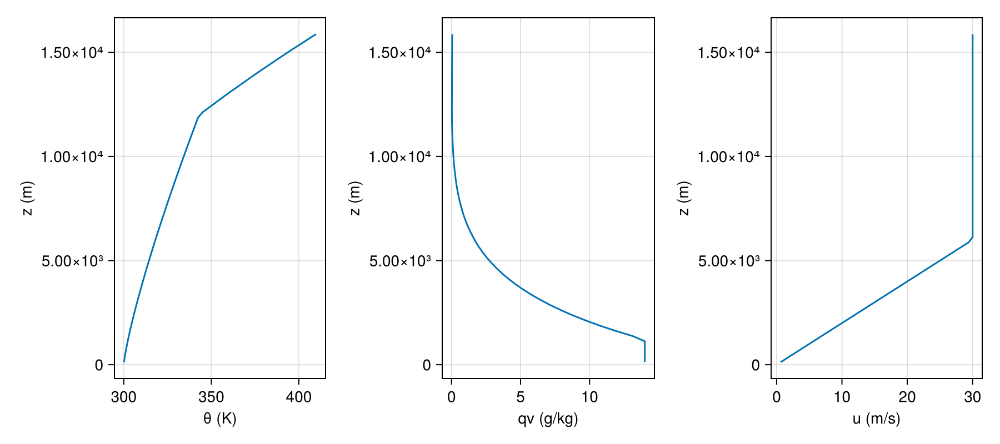

# LegacyConnectors.jl

[](https://github.com/NumericalEarth/LegacyConnectors.jl/actions/workflows/CI.yml)
[](https://numericalearth.github.io/LegacyConnectors.jl/stable)
[](https://numericalearth.github.io/LegacyConnectors.jl/dev)
[](https://codecov.io/gh/NumericalEarth/LegacyConnectors.jl)
[](LICENSE)

Readers and adapters that let [Breeze.jl](https://github.com/NumericalEarth/Breeze.jl)
ingest initial conditions from legacy atmospheric modeling formats —
starting with the CM1/WRF/ERF `input_sounding` text format.

This package exists so Breeze.jl itself can stay focused on its
dynamical core. See [NumericalEarth/Breeze.jl#672](https://github.com/NumericalEarth/Breeze.jl/discussions/672)
for the motivating discussion.

## Install

```julia
using Pkg
Pkg.add(url = "https://github.com/NumericalEarth/LegacyConnectors.jl")
```

## Quickstart

Read a sounding, load its profiles onto Oceananigans `Field`s on a
Breeze grid, and plot them with the Oceananigans Makie extension:



```julia
using LegacyConnectors, Breeze, CairoMakie

sounding = read_sounding(example_sounding(:weisman_klemp_1982))

grid = RectilinearGrid(CPU(); size = (1, 1, 64),
                       x = (0, 1), y = (0, 1), z = (0, 16_000),
                       topology = (Periodic, Periodic, Bounded))

θ, qv, u = (CenterField(grid) for _ in 1:3)
for (f, p) in ((θ, :θ), (qv, :qv), (u, :u))
    set!(f, sounding; profile = p)
end

fig = Figure(size = (900, 400))
ax_θ  = Axis(fig[1, 1]; xlabel = "θ (K)",     ylabel = "z (m)")
ax_qv = Axis(fig[1, 2]; xlabel = "qv (g/kg)", ylabel = "z (m)")
ax_u  = Axis(fig[1, 3]; xlabel = "u (m/s)",   ylabel = "z (m)")
lines!(ax_θ,  θ)
lines!(ax_qv, qv * 1000)
lines!(ax_u,  u)
fig
```

To go further and build the hydrostatic base state Breeze uses for
its anelastic / compressible split, pass the same sounding to
`LegacyConnectors.reference_state`:

```julia
ref = LegacyConnectors.reference_state(sounding, grid)
# ref.pressure, ref.density, ref.temperature are Fields — plot them
# the same way.
```

The literated examples walk through both paths in detail — and the
Weisman & Klemp example makes the case for skipping the file
entirely when you have analytic forms:

- [Weisman & Klemp 1982: analytic vs sounding](https://numericalearth.github.io/LegacyConnectors.jl/dev/literated/weisman_klemp_supercell/)
- [Loading a real sounding into Breeze (KABQ + ReferenceState)](https://numericalearth.github.io/LegacyConnectors.jl/dev/literated/breeze_field/)

If you only need the raw profile (no Breeze dep):

```julia
using LegacyConnectors
sounding = read_sounding(example_sounding(:weisman_klemp_1982))
@show sounding.surface_pressure, length(sounding)
```

## Bundled example soundings

| Name | Source |
|---|---|
| `:weisman_klemp_1982` | Analytic supercell sounding, regenerable from `data/soundings/generate_weisman_klemp_1982.jl`. |
| `:kabq_radiosonde`    | KABQ radiosonde, 2025-07-15 00Z. |
| `:abudhabi_gfs`       | Abu Dhabi GFS point forecast, 2025-07-15 12Z. |

See [`data/soundings/README.md`](data/soundings/README.md) for full
provenance.

## License

Apache-2.0 — see [LICENSE](LICENSE).
